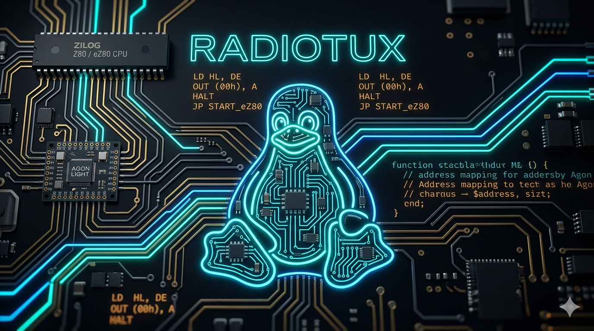

  

# A collection of software tools for the Agon Light microcomputer and its derivatives

This repository contains a collection of software developments and utilities designed for the Agon platform. Each directory includes the respective source code and documentation.

## 🔗 Official Resources

* **Toolchain:** Compiled and built using [AgonDev (C/C++ Toolchain)](https://github.com/envenomator/agondev
* **Fab Agon Emulator:** https://github.com/tomm/fab-agon-emulator
* **Agon VDP:** https://github.com/AgonPlatform/agon-vdp
* **Agon MOS:** https://github.com/AgonPlatform/agon-mos
* **Agon Documentation:** Refer to the [Community Agon Platform Documentation](https://github.com/AgonPlatform/agon-docs) for comprehensive hardware and firmware guidelines.

## 🛠️ Compilation

All programs in this repository must be compiled using **AgonDev**. 

To compile any of the projects:
1. Navigate to the specific program's directory.
2. Ensure your AgonDev environment is properly configured.
3. Run the compilation command (typically `make` if a `Makefile` is provided in the `/src` directory).

## 📂 Included Projects

This repository includes the following programs and tools:

* **alarm**
* **bat**
* **deltree**
* **diff**
* **echo**
* **find**
* **get**
* **grep**
* **head**
* **locate**
* **minicom**
* **ntpsync**
* **setcolor**
* **setmode**
* **sort**
* **tail**
* **touch**
* **uniq**
* **updatedb**
* **wc**

## 📄 License

This project is released as **Free Software**. You are free to use, study, modify, and redistribute the source code under the terms of open-source development.
